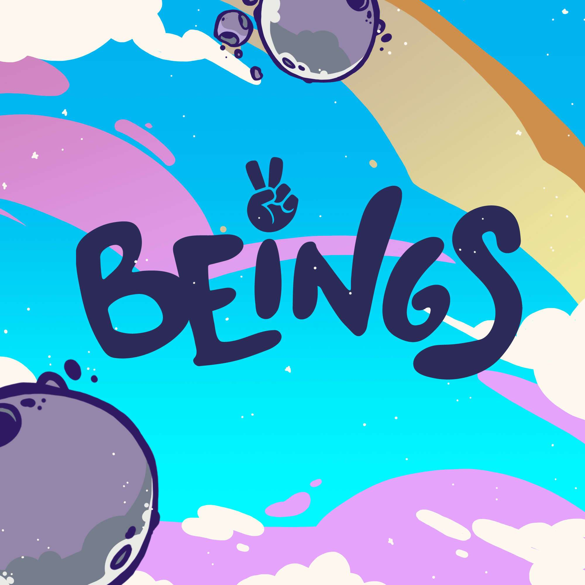

# Beings Official

探索多彩的宇宙！Beings 是一个由 5615 个社区驱动的收藏品，随机生成和风格化的 NFT，存在于以太坊区块链上。众生有各种各样的颜色、特征和大小！众生持有者可以参加众生学院、NFT认领、抽奖、社区赠品等独家活动。

在 Beings，除了为我们的会员带来各种形式的效用外，我们还是一个专注于整合、多样化和团结社区的系列。我们相信一个充满色彩的统一世界，所有的生命都可以成为他们自己而不受任何评判。

