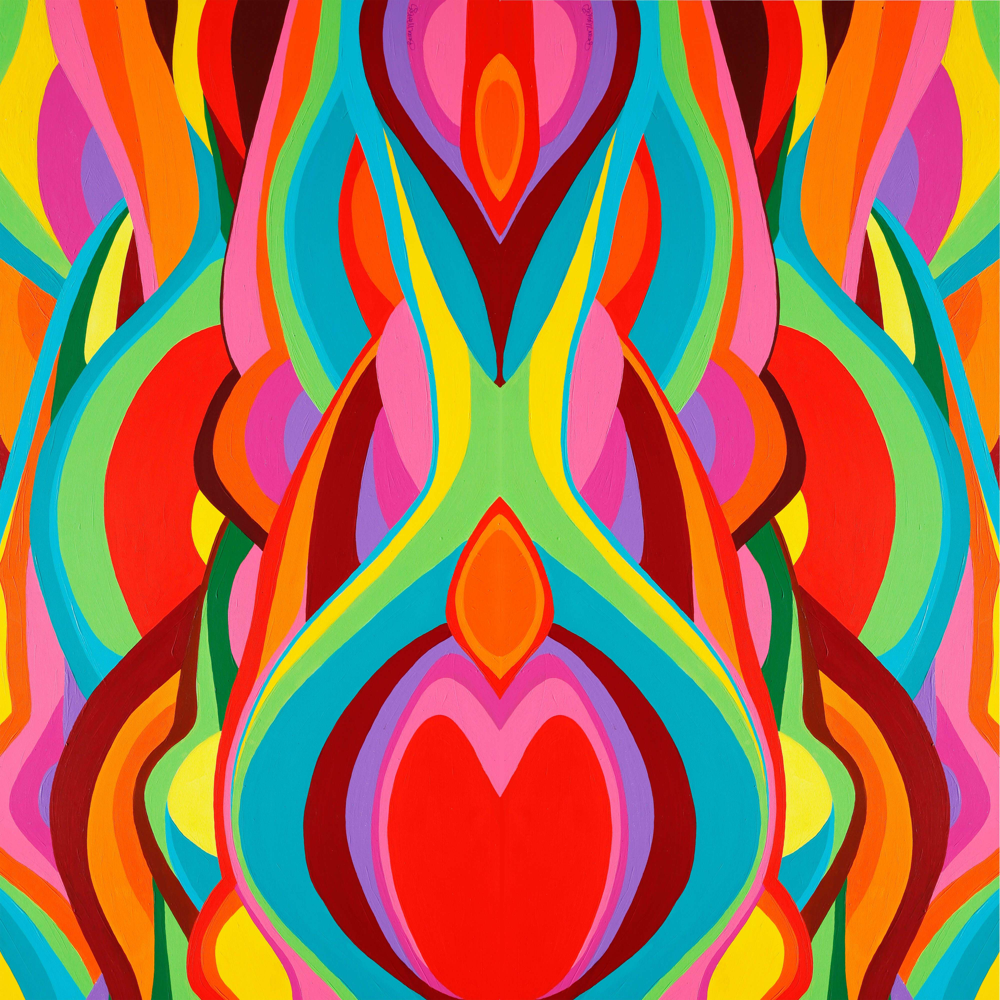

# Bekx Pride

看待事物的方式有很多种，也许这就是我在绘画时旋转画布的原因。我使用混合媒体和丙烯酸树脂来添加图层。我从画布上的颜料移动开始，有时用手指混合和涂抹颜色。形状和纹理形成，图像向我展示。最后一件作品下面通常有2-3幅画；每一个都是我试图处理的不同的故事、情感或与世界的互动。每一次创作，都感受着人类精神的奋斗；放手、自由、无界限地玩耍，克服了需要控制生活细节、互动和完成事情的方式的限制。在每一件作品中都有这种放手行为和控制需求的双重性。-贝卡

