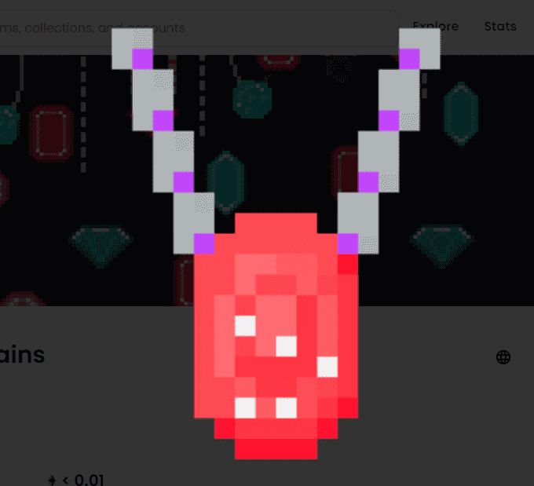

# Ben Baller BlockChains

区块链是 Ben Baller 的 NFT 项目的基石。持有 BlockChains 可赚取 $BallerBars，使用 $BallerBars 在第 1 阶段铸造更多 BlockChains，在第 2 阶段铸造宝石。

完全上链。没有服务器，只有代码。于 21 年 12 月 12 日铸造：存在 3578 个。2422 被烧毁。总共6000。

Notables 自豪地宣布 Ben Baller 完成了区块链。欢迎来到世界上第一个完全上链珠宝的例子。

BBDTBC 是一个实用程序驱动的 NFT 项目，其中稀有的 NFT 可以带来远远超出元界范围的宝藏。

Notables 是名字，Ben Baller 做了 BlockChain。

