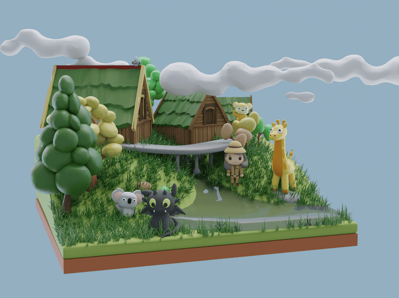

# Bettyverse Zookeepers

Bettyverse Zookeeper Collection 由 10,000 个独特的 Zookeeper NFT 组成，它们生活在 Polygon 区块链上。Zookeeper NFT 授予其持有人访问 Bettys Zoo P2E 游戏的权限。

动物园管理员授予他们的持有者：1.) Bettyverse 中使用的 3-D Zookeeper 头像 2.) Bettyverse 中的一块土地 3.) Zookeeper NFT 中的每只动物（在属性中找到）4.) ZOOBLE 5.)访问 Bettys Zoo P2E 游戏,Polygon 是一个面向使用以太坊区块链的开发人员的软件平台，承诺提供 2000 万美元，作为今年完全抵消其二氧化碳排放影响的努力的一部分

