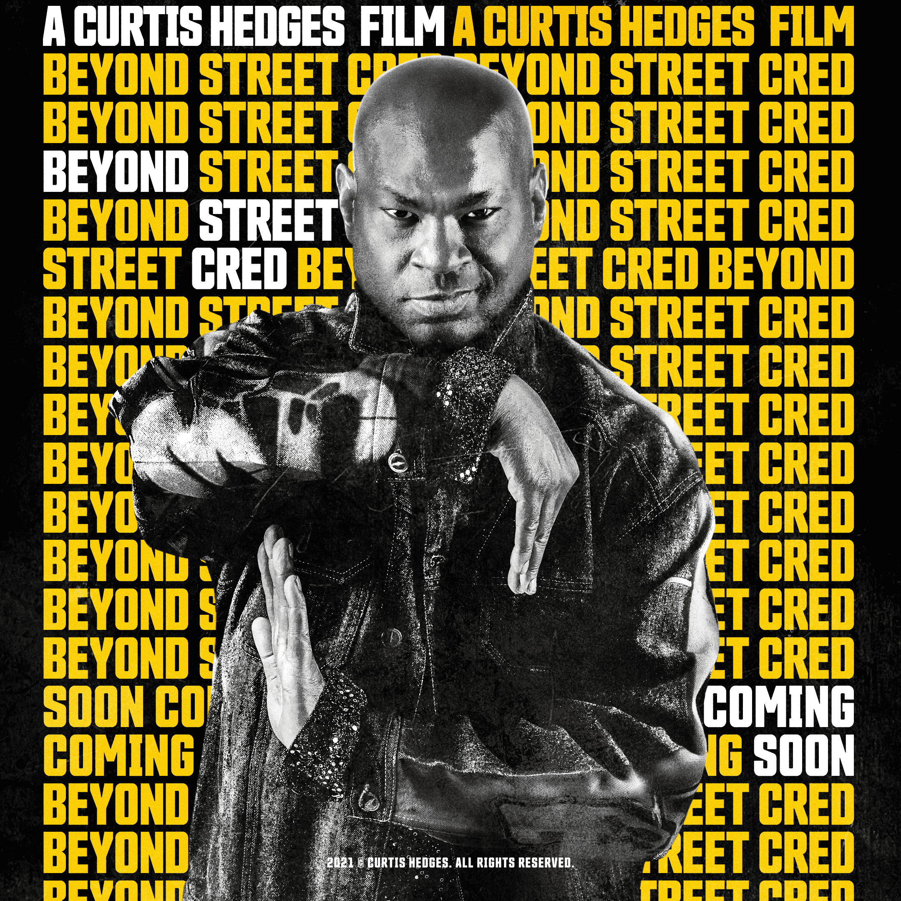

# Beyond Street Cred

一个社区驱动的 NFT 项目，可将电影系列、虚拟世界聚会和慈善筹款合二为一。来自世界各地最有才华的嘻哈舞者和武术家齐聚一堂，制作了一生难得一见的电影。由好莱坞最具标志性的 Poppers、Lockers、Breakers 和武术家制作、导演、编剧和主演。10% 的公共造币厂和 7.5% 的二次销售流向了 St. Judes Children Research Hospital。由迈克尔·钱伯斯、辛西娅·罗斯洛克、洪文林和莱昂·卡斯韦尔等主演

