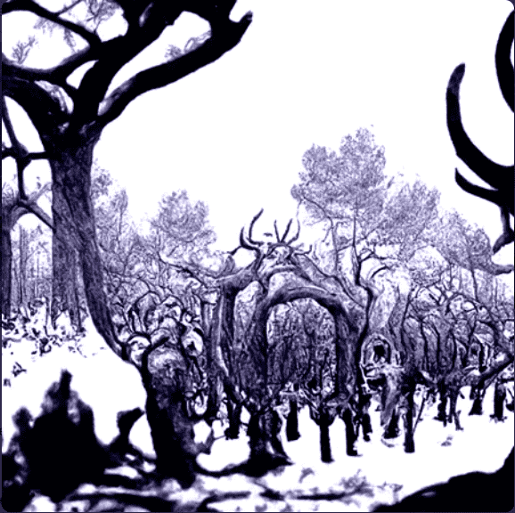

# Beyond the Boundaries

超越边界 NFT - 常见问题 (FAQ)
▶ 什么是超越界限？
Beyond the Boundaries 是一个 NFT（不可替代代币）集合。存储在区块链上的数字艺术品集合。
▶ 有多少 Beyond the Boundaries 代币？
总共有 503 个 Beyond the Boundaries NFT。目前，243 位所有者的钱包中至少有一个 Beyond the Boundaries NTF。
▶ Beyond the Boundaries 拍卖中最贵的是什么？
最昂贵的 Beyond the Boundaries NFT 是 Beyond the Boundaries #182。它于 2022-06-14（3 个月前）以 85.8 美元的价格售出。
▶ 越界最近卖出了多少？
过去 30 天内售出了 130 个 Beyond the Boundaries NFT。
▶ 超越界限的费用是多少？
在过去 30 天里，Beyond the Boundaries NFT 最便宜的销售额低于 21 美元，最高销售额超过 63 美元。Beyond the Boundaries NFT 的中位价格在过去 30 天内为 37 美元。
▶ 什么是流行的超越边界的替代品？
许多拥有 Beyond the Boundaries NFT 的用户还拥有 3gm Genesis Pass、 TerrapinGenesisNFT、 Little Ones NFT和 BrawlerZ Kingdom。

