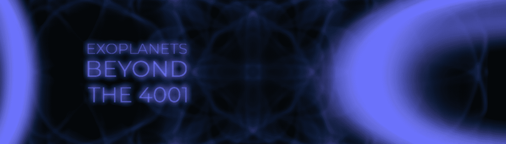

# Exoplanets: Beyond the 4001

一个社区驱动的宇宙，它利用特定数据生成随机的系外行星。 在我们的银河系中估计有 100-4000 亿颗恒星。 4001 计划中只有 4001 颗系外行星。为我们的 Exonauts 设计的独家 1:1 生成艺术作品，将通过艺术诠释接近奇点时的旅程。4001 项目是一个社区驱动的项目。

OG 持有者和拥有 5 颗或更多系外行星的人被列为（见排名）具有投票权的国家持有者。

该等级允许持有者参与 The 4001 Project 的重大决策，例如定价、降价等。

