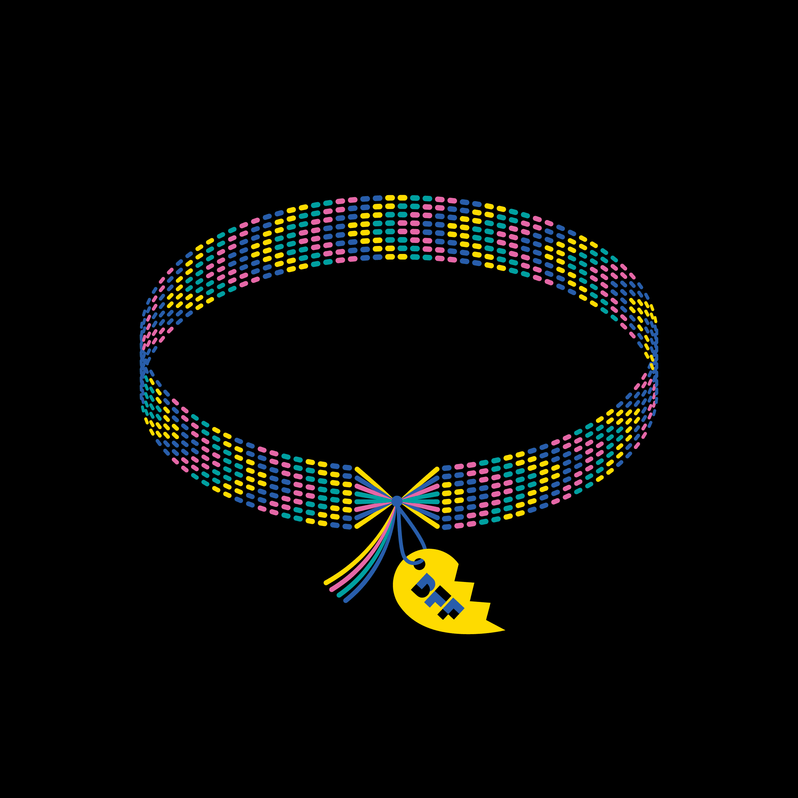

# BFF Friendship Bracelets

一个新的互联网时代已经开始，它被称为“web3”。未来 5 年，其市值预计将达到 10 万亿美元。问题？目前81%的参与者是男性。

BFF由100 多位各行各业的领导者创办，是一个开放访问社区，其使命是帮助女性和非二元性别的人在 web3 中接受教育、联系和授权。

我们的目标是创建互联网上最大的去中心化品牌之一。

BFF 的首个 NFT 系列，你，庆祝我们社区和世界各地女性和非二元朋友的独特性。艺术家 [Jade Purple Brown]以其著名的风格为该系列中的 10,000 件独特作品带来鲜艳的色彩和动态的表达。

每个 NFT 都内置了独特的特权，以及 BFF 宇宙中的实用程序。

