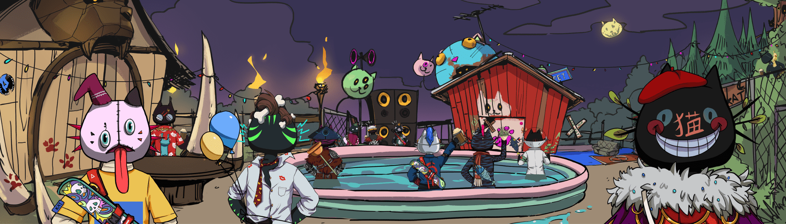

# BlackInBackKat

收集 4,444 Black Katz 入侵以太坊网络。

Katz 即将去某个地方，但谁知道他们会去哪里？Kat 加入并定居为 3 个氏族：Skull 氏族、Wild 氏族和 Gangsta 氏族。你的凯特会去哪个氏族？

每个 Black In Back Kat NFT 持有者都可以访问 Discord、Twitter 等上的独家活动。持有者还拥有他们持有的 Black In Back Kat NFT 的完全商业权利！

BlackInBackKat 泳池

KAtz 是一种实用代币。目的是使用它来执行 BlackInBackKat 生态系统中的某些功能。

\- 您可以在您的钱包中交换 1 BlackInBackKat 以获得 1 $KATz。交换后，您的 BlackInBackKat 将被发送到池中。
\- 您可以使用 1 $KATz 在池中兑换 1 BlackInBackKat。
\- 您可以使用 1 $KATz 升级 BlackInBackKat。

