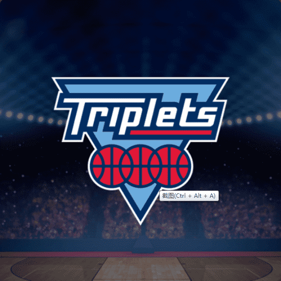

# Official BIG3 Ownership

BIG3 Ownership 是一种创新的、全新的职业运动团队所有权方法。该联盟正在通过利用区块链技术销售代表其 12 支球队类似所有权价值的 NFT 来创建一种新的所有权模式。

所有版本均包含对团队行动的投票权、无价的比赛日体验和所有比赛的 VIP 门票，以及限量版球队、联赛和冠军商品和纪念品。Fire 版本还包括团队名称、徽标和商品的独家知识产权和许可权，以及额外的比赛日激活。

