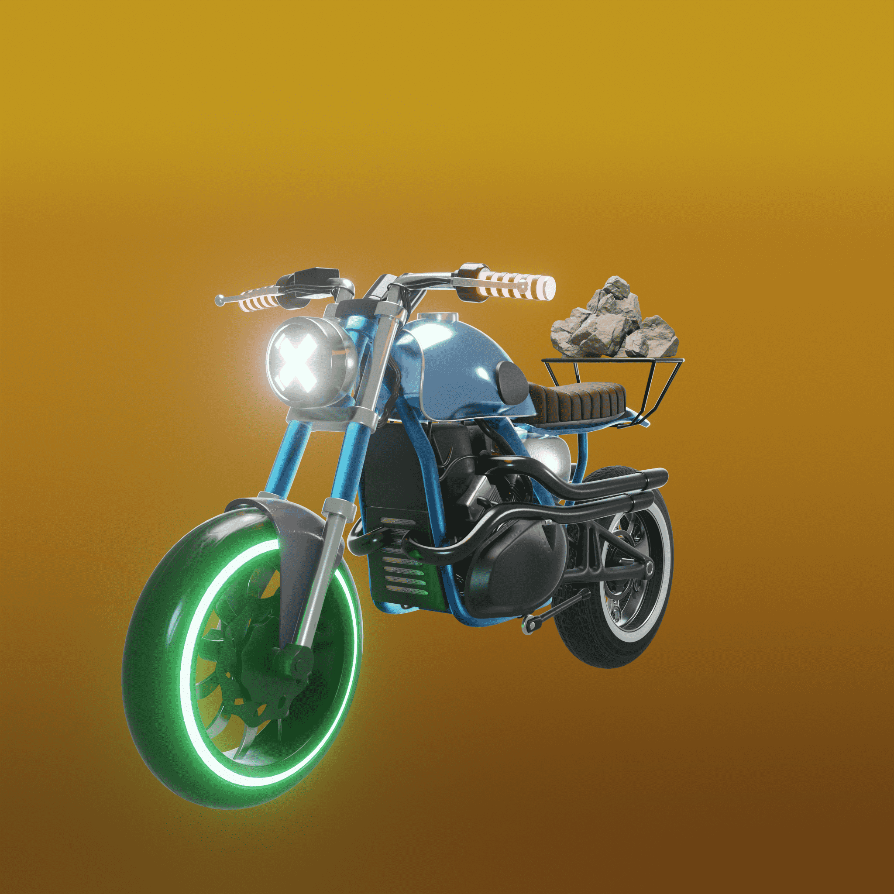

# BikersNFTBike

1,111 区块链骑手是 NFT 世界中骑手文化的生态系统 - 为他们带来了完整的 PFP 体验。

随着尘埃落定，只剩下一个化身，骑自行车的人开始自己装备头盔，用一句简单的#rideordie 语句运行 Twitter 诗句。

他们来到他们的车库并声称他们的自行车是时候创建一个传统的

区块链自行车手是令人难以置信的艺术和社区的基础。一位顶级艺术家开发了骑自行车的人，我们迫不及待地想用经验打造顶级艺术。

您将获得艺术品背后 100% 的知识产权和权利。150 个属性和 9 个类别/属性。
‍ 我们
开始这一旅程的目的是为我们的帮派提供一个以上的 PFP NFT，一旦您准备好 PFP 准备解锁您的车库和您将骑的自行车。会员可以免费参加所有活动

