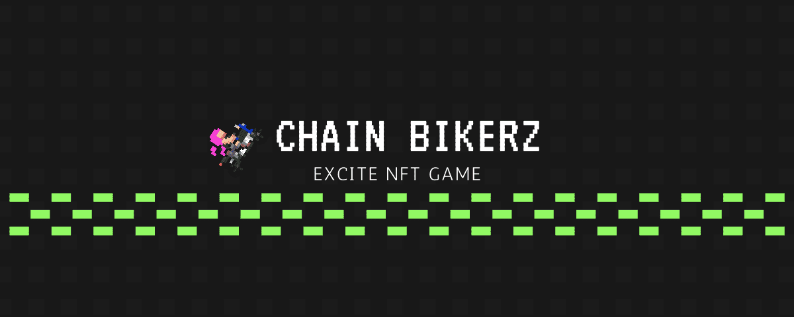

# Bikerz Excite

### Chain Bikerz 特点

10 个独特的头盔

或者幸运地获得 7 个独特的灵感链 Runnerz 头之一

3,193 个独特的帮派名称

20 种独特的自行车颜色

8个不同的等级

链上日增声誉

### 链上挑战！

   1.从招募等级开始

2. 每次你击败另一个链式摩托骑手，你的等级就会增加 ,并且你获得的声望与被挑战的摩托骑手的声望相等

3. 每次被挑战的骑自行车的人输了，他们就会加入你的帮派

  4.被挑战者现在被挑战者拥有，并且文本“Owned By: TokenNumber”

  5.一旦拥有就不能发起挑战

6. 每6000个区块只能发起挑战。您只能每 6000 个区块挑战一次

   
