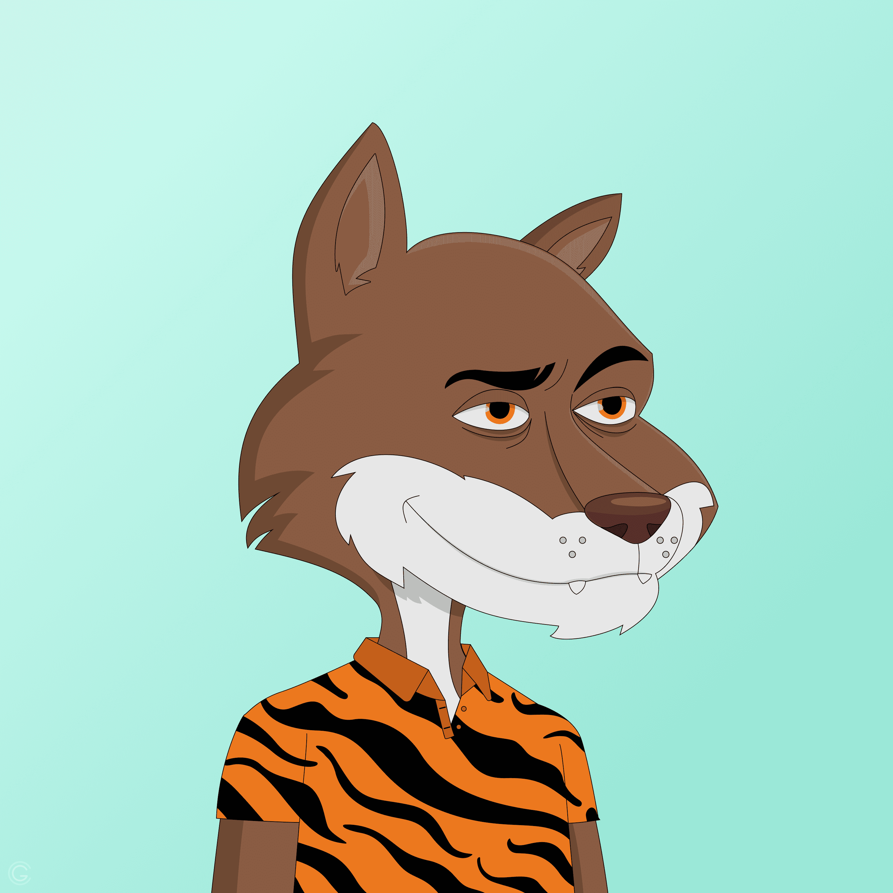

# Billionaire Coyote Cartel

真实拥有者数量：1,305（更新于 22 年 1 月 7 日）真实拥有者数量高于 OpenSea 显示的数量，因为大多数土狼仍处于质押状态。

亿万富翁 Coyote Cartel 主要（但不完全）为我们的社区购买蓝筹 NFT。作为 BCC NFT 所有者，您既可以获得我们 DAO 的投票权，也可以获得我们 DAO 持股的部分所有权。

▶ 什么是亿万富翁 Coyote Cartel？
亿万富翁 Coyote Cartel 是一个 NFT（不可替代代币）集合。存储在区块链上的数字艺术品集合。
▶ 亿万富翁 Coyote Cartel 代币有多少？
总共有 2,222 个亿万富翁 Coyote Cartel NFT。目前，750 位所有者的钱包中至少有一个亿万富翁 Coyote Cartel NTF。
▶ 亿万富翁 Coyote Cartel 最昂贵的交易是什么？
售出的最昂贵的亿万富翁 Coyote Cartel NFT 是 Billionaire Coyote #1009。它于 2022-08-27（6 天前）以 168.8 美元的价格售出。

