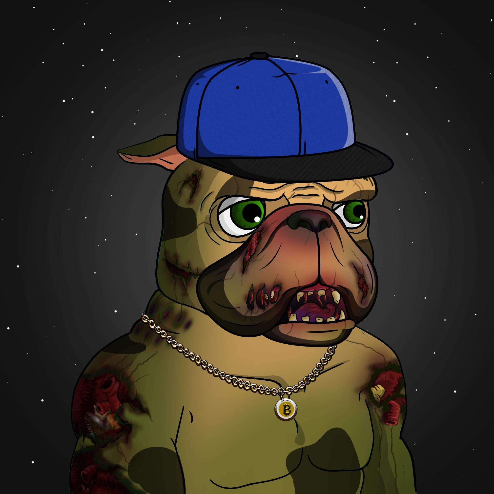

# Billionaire Dogs Club BDC

亿万富翁狗俱乐部是生活在以太坊区块链上的 2000 只独特狗的集合。

每只狗都是完全独一无二的，并且是使用 120 多个单独的功能创建的，这些功能存储为托管在 IPFS 上的 ERC-721 令牌。

拥有 BDC NFT 将转化为我们社区的独家会员资格，让您可以访问高端专业网络，并获得实实在在的好处。

▶ 什么是 Billionaire Dogs Club BDC？

Billionaire Dogs Club BDC 是一个 NFT（非同质代币）集合。存储在区块链上的数字艺术品集合。

▶ 有多少 Billionaire Dogs Club BDC 代币？

总共有 1,991 个 Billionaire Dogs Club BDC NFT。目前，1,196 名业主的钱包中至少有一个 Billionaire Dogs Club BDC NTF。

