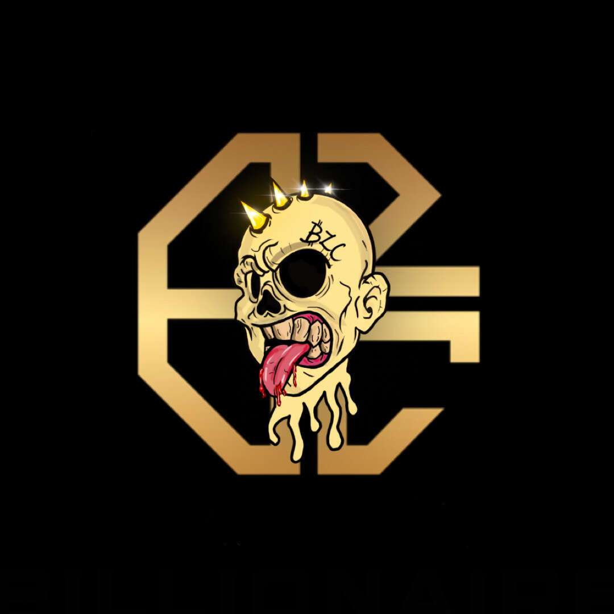

# BillionaireZombiesClub mirror

Billionaire Zombies Club 是 Polygon 区块链上随机生成的 Zombies 和 Skeleton Kings NFT 的集合。第一代僵尸包含 10,000 个僵尸，骷髅王是 731 个集合。

如果您想加入僵尸俱乐部，请使用我们的亿万富翁僵尸俱乐部、骷髅王和元界系列的官方链接购买资产二级市场。

在大翻转期间，创造了比历史上任何时候都多的亿万富翁。

但这并没有持续下去。

它成为了一个世界遭受一系列长期史诗般灾难的时代。疾病肆虐世界，北美几乎着火了，整个墨西哥湾因漏油而起火，印度洋突然爆发火山（谁知道？），流星撞击格陵兰岛。

你说它，它发生了。这是一场完美的世界灾难风暴，这里不胜枚举。有些人转向他们的宗教。其他人则将资源用于失败的火星火箭。但大多数情况下，人们聚会就像是世界末日一样。

然后，世界一片漆黑。

这将我们带到了今天。随着行星重新调整其旋转轴并且磁场稳定，冰开始融化。

僵尸和骷髅王在这场大解冻中苏醒，是地球上唯一剩下的“人”。所以，既然你们都追上了世界末日的历史，一个新的开始出现了。

你应该问自己：你是为所有人建立一个更好的文明，还是创建一个只有你才能统治的僵尸王国？

有了它，开始按照你的形象重建一个新世界吧！

