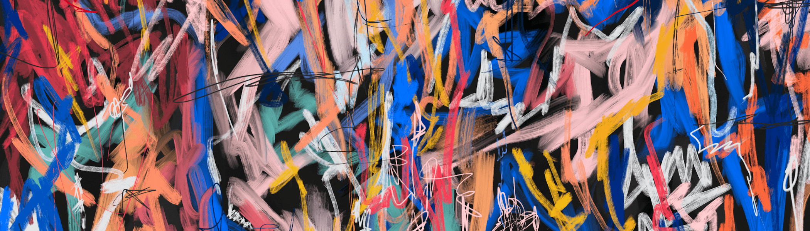

# Bilnd Abstract

比兰德

##### 数字艺术家 | 音乐家 | NFT | 使用形状和颜色的抽象艺术Bild，跨学科艺术家 Richard Chappelow 的项目,抽象表现主义和极简主义等艺术运动对包豪斯和五角星等机构进行了设计。艺术家，包括琼·米罗、布里奇特·莱利、马克·罗斯科和杰克逊·波洛克。另一个关键影响是工业设计师 Dieter Rams，他的美学和设计选择。他对简单形式和功能的关注帮助理查德形成了“简单而美丽”的指南，这是他在所有作品中都努力坚持的。经过 

探索时间和运动的概念专辑

Tracklist
Rise
Move
Gaze
Push
Grids

持续时间 35:30

由 Rare Tone Mastering的 Bild 创作、录制和制作

