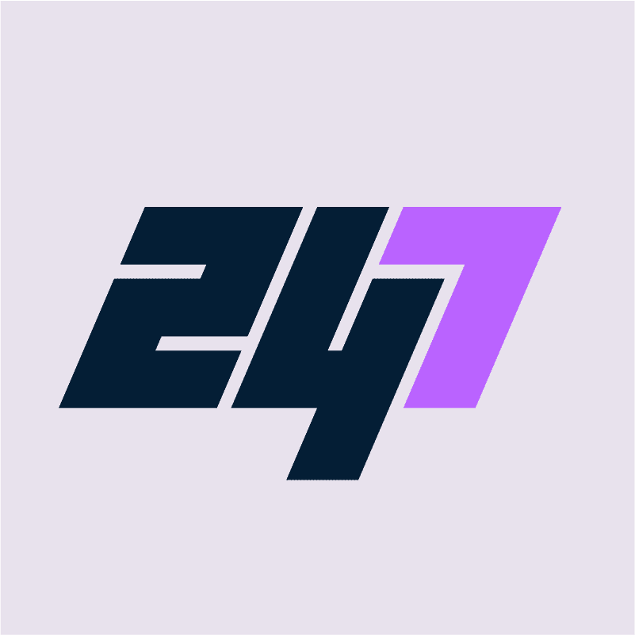

# BiPlane Bobo

独家持有人预览现已在我们革命性的 247 COMICS READER（测试版）上提供，飞上天空，加入 BiPlane Bobo 的旅程。作为 247 Comics 生态系统的初始门票，BiPlane Bobo 系列为持有者提供了与 Bobo 一起构建的能力，并帮助塑造 BiPlane Bobo 特许经营权的未来。Bobo 由 247 Comics 艺术主管 Sean Chen 创作。作为漫威和 DC 的漫画书艺术家，肖恩因其绘制标志性超级英雄的作品而广为人知，包括钢铁侠、金刚狼、X 战警、新星、超越蝙蝠侠等。伟大的艺术。伟大的故事。247 是我们实现梦想的地方，欢迎所有想要参与其中的人。我们是一个以创作者为主导的项目，其中艺术和故事是最重要的。凭借我们创作者的远见和社区的支持，我们正在为 Web3 创新和调整漫画书行业。访问 247comics.com 了解更多详情。

