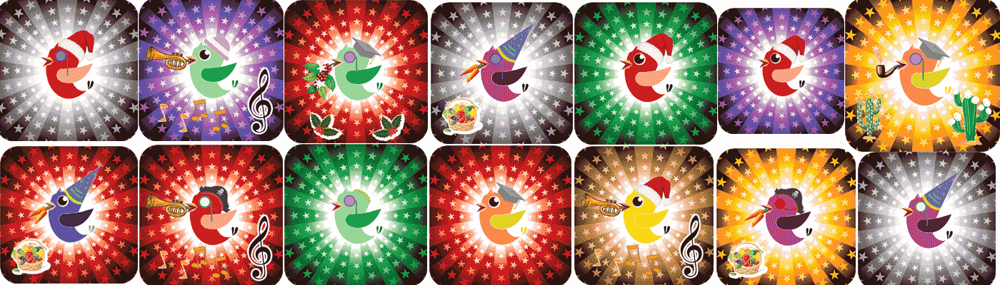

# Birds Race NFT

3500 只独特的鸟类，每一只都与其他鸟类完全不同。所有人都使用 ERc721 合约在以太坊空间中作为 NFT 飞行。购买一只您将能够在赛鸽比赛中分享并从您的鸽子中获益的鸽子。我们有不同的鸟类风格，其中大部分仍然是免费的，并且会随着时间的推移而升级。作为第一代，我们有 3250 只独特的鸟类。其他生物来了,首次玩并赚取游戏的 Fancy Birds Genesis 收藏！过去 30 天最畅销的 Birds Race NFT

