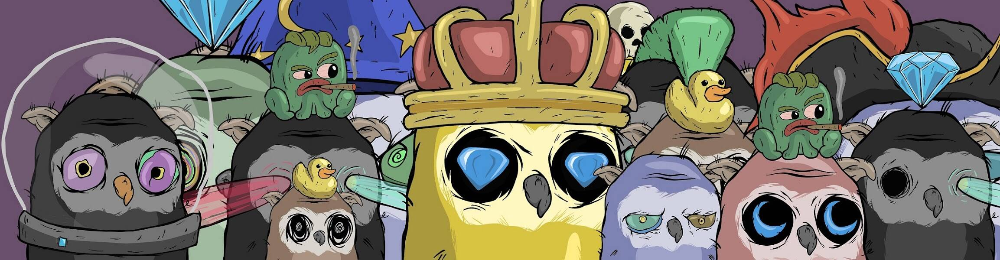

# Birdstown.wtf

##### ▶ 什么是 Birdstown.wtf？

Birdstown.wtf 是一个 NFT（非同质代币）集合。存储在区块链上的数字艺术品集合。

##### ▶ 有多少 Birdstown.wtf 代币？

总共有 5,000 个 Birdstown.wtf NFT。目前，452 位业主的钱包中至少有一个 Birdstown.wtf NTF。

##### ▶ 最昂贵的 Birdstown.wtf 销售是什么？

售出的最昂贵的 Birdstown.wtf NFT 是 它于 2022-06-06（3 个月前）以 14.5 美元的价格售出。

##### ▶ 最近卖出了多少 Birdstown.wtf？

过去 30 天内共售出 47 个 Birdstown.wtf NFT。

##### ▶ Birdstown.wtf 需要多少钱？

在过去 30 天里，Birdstown.wtf NFT 最便宜的销售额低于 1 美元，最高销售额超过 3 美元。在过去 30 天内，Birdstown.wtf NFT 的中位价格为 3 美元。

