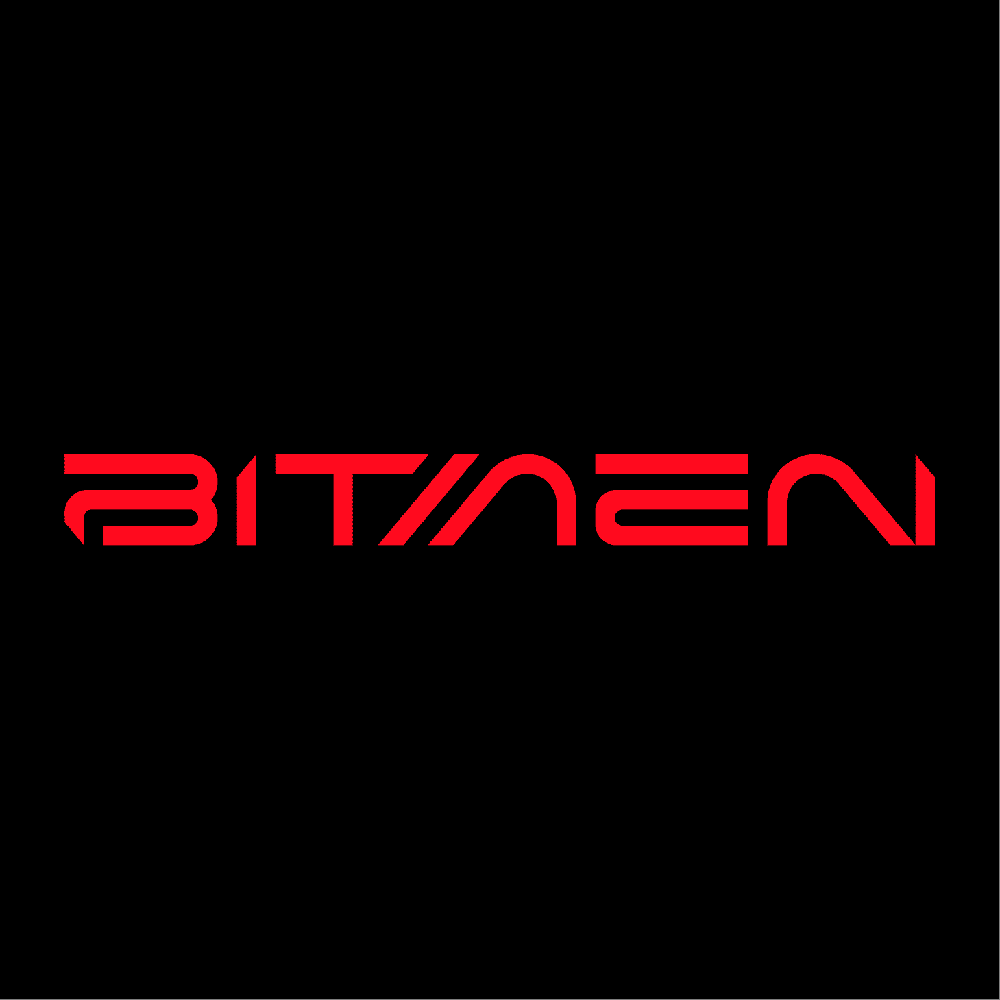

# BITMEN - EVOWARE

BITMEN发明了一种可以携带虫子的沙漏装置——EVOWARE（α），通过它他们打开了新的虚拟宇宙的传送门，穿越到了现在。他们挑选了一批合格的“老人类”，帮助他们进化升级，教他们如何建造进化装置，但进化原理和实际操作对BITMEN来说是绝密……

BITMEN 由一群超人类创立。他们是为解放人民而战的冒险家，为殖民项目训练的高科技雇佣兵，生活在地下基地的富裕氏族，超古老部落的先知，以及拥有独特技能的疯狂发明家。他们通过虫子回到过去，寻找新的血液，在主宇宙中施加新的命令……超人类的 DNA 被改变并作为信号传输到主宇宙。他们被赋予了新的分身和超能力，有些甚至继承了第一代BITMEN的力量。每一个BITMEN都配备了多功能设备，以发挥其无限潜力。他们形成了主宇宙的集体意识。

