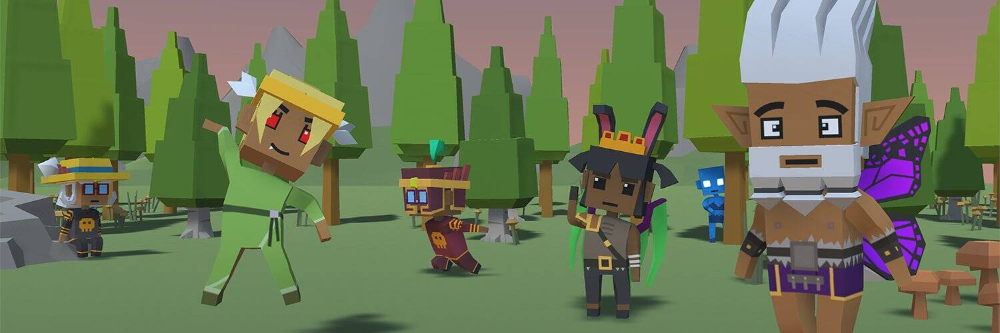

# Bizarros

他们不知道现在是哪一年。他们能记住的第一件事就是掉到一个满是奇怪生物的星球上，这些生物似乎无法对 NFT 闭嘴。Bizarros 是怎么来的？这背后是谁或什么？这些其他角色是谁？猫、猴、狗……

玩即将到来的游戏，探索 NFT 社区的模仿版本，结识著名的 NFT 人物，并作为 Bizarro 找出你是谁以及你为什么在那里。完成任务，与敌人战斗，参加迷你游戏（链上的高分记录）和探索。

Bizarros 是 10,000 个独特的 3D Bizarro NFT 的集合——生活在以太坊区块链上的独特数字收藏品。您的 Bizarro 兼作 Bizarro World RPG 的门票，并授予会员专享福利，其中第一个将是访问 The Tavern，这是一个您可以与 Bizarro 同伴见面和聊天的聚会场所，并帮助塑造故事情节和功能Bizarro World 游戏。

