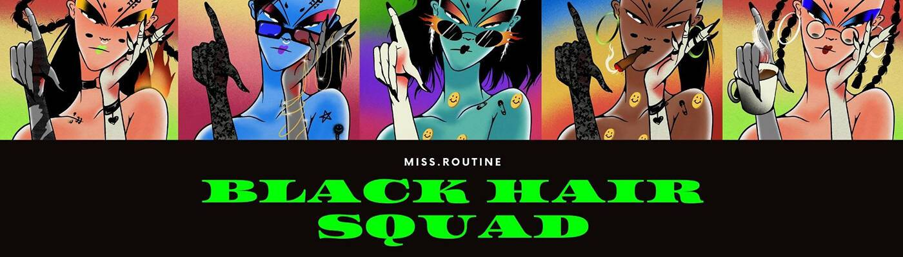

# BLACK HAIR SQUAD

生成艺术手绘超过 100 层到一个独特的角色。您可以在 Polygon 上以实惠的价格轻松收集她，无需支付汽油费，并通过智能合约铸造。仅限 300 黑发。（1stGEN 200, 2ndGen 100 漫画风格>>我将在 1st 售罄时推出 2ndGEN。）

##### ▶ 什么是黑发小队？

BLACK HAIR SQUAD 是一个 NFT（非同质代币）集合。存储在区块链上的数字艺术品集合。

##### ▶ BLACK HAIR SQUAD 代币有多少？

总共有 200 个 BLACK HAIR SQUAD NFT。目前 9 位所有者的钱包中至少有一个 BLACK HAIR SQUAD NTF。

##### ▶ 最近卖出了多少 BLACK HAIR SQUAD？

过去 30 天内售出 0 个 BLACK HAIR SQUAD NFT。

