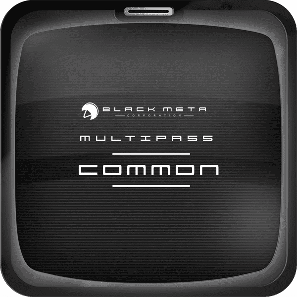

# Black Meta Multipass

随着流星向地球坠落，精英、强大和无情的人为登上黑色元研究设施的通道而战。留在外面的人会死。那些获得访问权的人可能会遭受更糟糕的命运。会发生突变。派系将形成。财富将被掠夺。

忽略它。笑吧。Metaverse将继续存在。它从未离开。世界上最成功的电子游戏——侠盗猎车手、口袋妖怪、模拟城市、魔兽争霸、我的世界——都是由公司建造和拥有的元宇宙。

即将到来的元界是由玩家建造和拥有的。这就是让它与众不同的原因。每天人们都拥有它。就像每天人们正在建造它一样。

请记住，侠盗猎车手在第一周发布了超过 1B 美元的版本，几乎与整个外星人系列一样多。乔治·卢卡斯 (George Lucas) 让他们都击败了《星球大战》，这仍然是历史上票房收入最高的媒体特许经营权之一，自成立以来已接近 70B 美元。

这就是在这个新世界中消费的市场。有一天 他们会在这个世界上生活、玩耍和工作。 问题不在于 Metaverse 是否会成功，而在于最终的生态系统和故事会胜出。

未来 5 年将是 思想和创造力的复兴， 感觉就像一场游戏。数以百万计的人齐头并进，创造新的宇宙以扩大规模，直到真正的玩家操作一个获胜。

