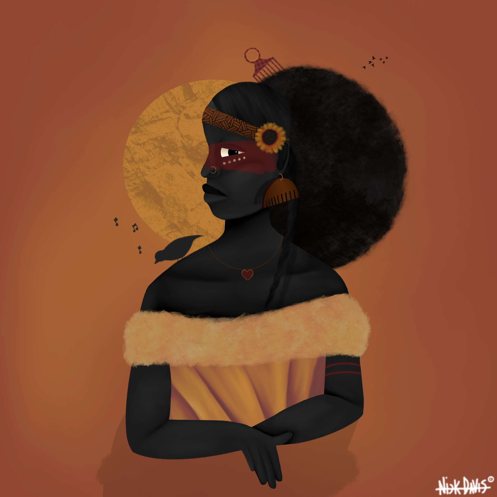

# Black Is Beautiful NFT

Black is Beautiful 是对美国黑人在美国日常生活的欢乐和挣扎中的原始情感的惊人描绘。这个包含 1000 个独特的、一对一的 NFT 的集合不仅仅是可收藏的艺术品 - 每个 NFT 都讲述着自己的故事。这些图像俏皮、温馨、健康、挑衅和鼓舞人心。

收藏家将受益于独一无二的艺术、社区、教育、访问、活动和特殊体验。以扩大代表性为使命，该系列还将与选定的 HBCU 合作，进一步帮助有色人种社区获得访问权、教育和洞察力，以增强下一代创作者和收藏家的能力。

基于我们的宗旨、召集和慈善事业的核心价值观，Black is Beautiful 系列致力于支持社区，并专门为 HBCU 提供战略资金。与持有人的集合合作，将选择一个轮换的 HBCU 小组——以及其他黑人组织和机构——接受慈善赠款以及教育、访问和参与机会。

初级销售额的 10%将平均分配给我们的前五个 HBCU：汉普顿、杰克逊州立大学、莫尔豪斯大学、摩根州立大学和斯佩尔曼。

10% 的二次销售将分配给由社区投票和社区提案选出的 HBCU 影响基金。

