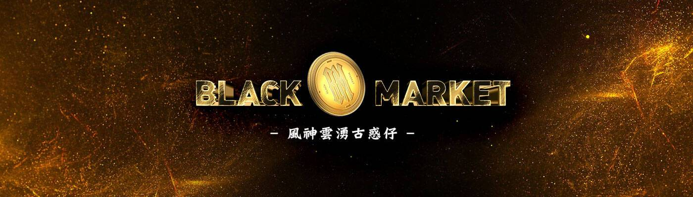

# BlackMarket Club

##### ▶ 什么是黑市俱乐部？

BlackMarket Club 是一个 NFT（非同质代币）集合。存储在区块链上的数字艺术品集合。

##### ▶ 有多少 BlackMarket Club 代币？

总共有 1,348 个 BlackMarket Club NFT。目前，435 位所有者的钱包中至少有一个 BlackMarket Club NTF。

##### ▶ BlackMarket Club 最昂贵的交易是什么？

出售的最昂贵的 BlackMarket Club NFT 是 . 它于 2022 年 6 月 9 日（3 个月前）以 505.5 美元的价格售出。

##### ▶ 最近卖出了多少 BlackMarket Club？

过去 30 天内售出了 6 个 BlackMarket Club NFT。

##### ▶ 什么是流行的 BlackMarket Club 替代品？

许多拥有 BlackMarket Club NFT 的用户还拥有 

