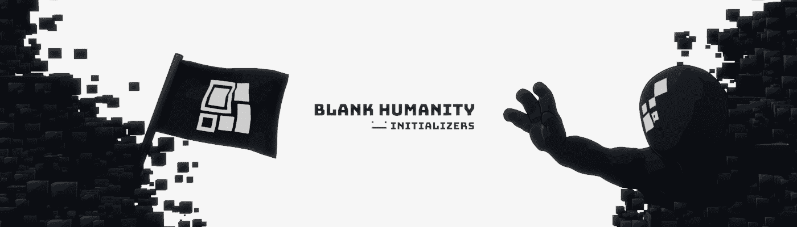

# BLANK_ Humanity Initializers

##### ▶ 什么是 BLANK Humanity Initializers？

BLANK Humanity Initializers 是一个 NFT（不可替代令牌）集合。存储在区块链上的数字艺术品集合。

##### ▶ 存在多少个 BLANK Humanity Initializers 代币？

总共有 969 个 BLANK Humanity Initializers NFT。目前，390 位所有者的钱包中至少有一个 BLANK Humanity Initializers NTF。

##### ▶ 最昂贵的 BLANK Humanity Initializers 销售是什么？

出售的最昂贵的 BLANK Humanity Initializers NFT 是。它于 2022-06-21（2 个月前）以 395.2 美元的价格售出。

##### ▶ 最近卖出了多少 BLANK Humanity Initializers？

过去 30 天内售出了 9 个 BLANK Humanity Initializers NFT。

##### ▶ 什么是流行的 BLANK Humanity Initializers 替代方案？

许多拥有 BLANK Humanity Initializers NFT 的用户还拥有

