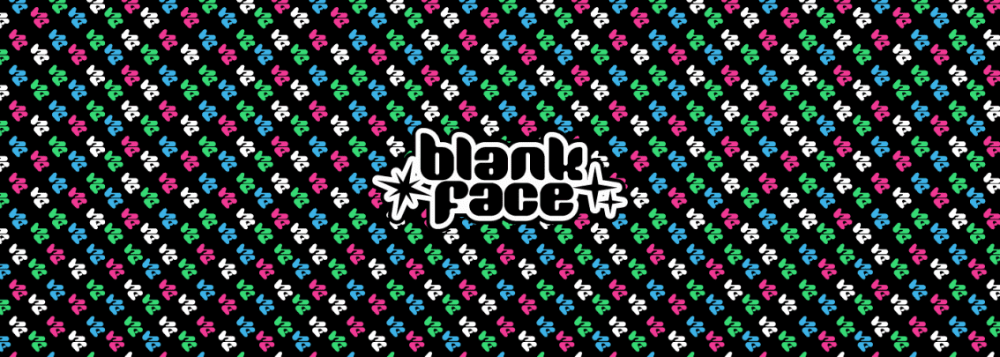

# BlankFaceHaylos

铸币厂开始日期：美国东部标准时间 21 年 9 月 25 日星期六下午 6 点 

- 薄荷结束日期：美国东部标准时间 21 年 10 月 4 日星期一下午 6 点
- 3 个版本，每个版本 0.01 ETH
- 每个钱包每个版本都可以铸造 1 个，无论您有 1 个 BlankFace 还是 50 个（或 1 个以上 haylos）
- 每个版本都将有自己的 1/1 抽奖，将奖励给该版本的 1 位铸币者。
- 即将推出的这些合作还将有额外的实用程序

##### ▶ 什么是 BlankFaceHaylos？

BlankFaceHaylos 是一个 NFT（非同质代币）集合。存储在区块链上的数字艺术品集合。

##### ▶ 有多少个 BlankFaceHaylos 代币？

总共有 2,466 个 BlankFaceHaylos NFT。目前，1,293 位所有者的钱包中至少有一个 BlankFaceHaylos NTF。

##### ▶ 最近卖出了多少个 BlankFaceHaylos？

过去 30 天内售出 0 个 BlankFaceHaylos NFT。

