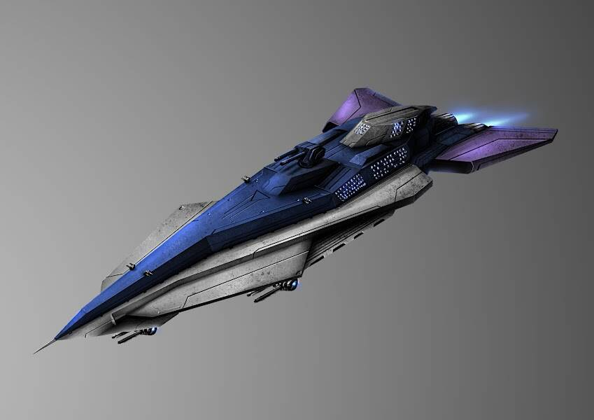

# BlazarForce

Blazar Force 是一家游戏组织，成立于 2019 年，旨在帮助希望赚钱的机上游戏玩家进入加密货币领域。它由来自世界各地的成员组成，致力于支持任何人都可以采用的以享受游戏为生的生活方式。BzB 的创建是为了激励成员并确保长寿。 

BlazarBits(BzB) 是部署到以太坊主网并桥接到多边形网络的 erc-20 代币。代币是将团队连接在一起的东西，它们可以通过执行有利于组织的任务来获得，并用于奖励决定保留它们的成员。创造了 250 万个代币，其中许多已被销毁以产生通货紧缩效应。代币将在决策中发挥至关重要的作用，允许持有者对不同的前进路径进行投票。300k BzB 代币的供应被保留给持有人可以用来资助活动和增长的国库。

