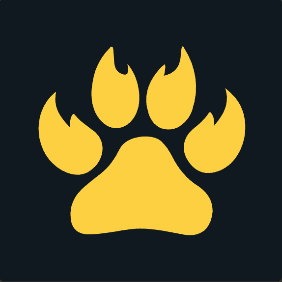

# Blazed Cats

Blazed Cats 是通过编程方式生成的永远的朋友，由手绘资产和各种特征、配饰和其他自定义项组成，使每只猫都具有可验证的独特性。 更好的是，每次您购买或出售 Blazed Cat 时，100% 的特许权使用费 (10%) 都会捐给 Mental Health America，这是一家领先的社区非营利组织，致力于满足精神疾病患者的需求。

2021 年 7 月下旬，一个由 5 名相对陌生的人组成的团队聚集在一起，结合各自的才能，尝试以前从未做过的事情； 整个 10k 头像项目，可通过智能合约在不到 24 小时内铸造。 随着时间的推移，超级团队创建了资产，编写了智能合约，设计了一个网站，并生成了数十万种可能的猫组合，并将其缩小到 10,000 种。 5 人致力于通过他们的壮举产生影响，承诺将 25% 的铸币收益和 100% 的二次特许权使用费捐赠给慈善机构。 在售罄薄荷糖时，Blazed Cats 已经通过 The Giving Block 直接向 Mental Health America 的钱包捐赠了超过 15 万美元。

