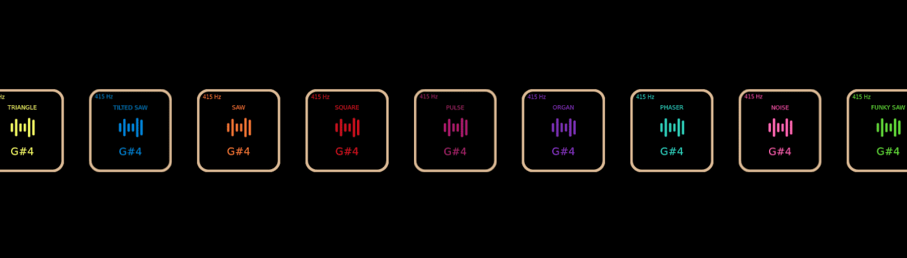

# Bleeps

哔哔声是第一个完全在链上产生的声音，外部性为零。每个 Bleep 在 Bleeps DAO 中投一票。它们也可以组合起来创建 Onchain 旋律。▶ 什么是哔哔声？

Bleeps 是一个 NFT（不可替代令牌）集合。存储在区块链上的数字艺术品集合。

##### ▶ 存在多少 Bleeps 代币？

总共有 576 个 Bleeps NFT。目前，225 位所有者的钱包中至少有一个 Bleeps NTF。

##### ▶ 最昂贵的 Bleeps 促销是什么？

出售的最昂贵的 Bleeps NFT 是它于 2022-06-15（2 个月前）以 53.3 美元的价格售出。

##### ▶ 最近卖出了多少 Bleep？

过去 30 天内售出了 2 个 Bleeps NFT。

