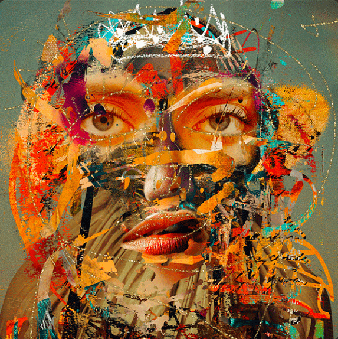

# Block Queens by Jeremy Cowart

Block Queens 是摄影师/艺术家 Jeremy Cowart 创作的拼贴艺术收藏品。它由 999 个手工层组成，结合了 Cowart 20 多年在摄影、绘画和素描方面的工作。借助 Transient Labs 的开创性元数据，每个 Block Queen 组合 11 层形成一件艺术品。

请务必全屏查看 Block Queens。单击并拖动它们。放大和缩小。右键单击并拖动以左右或上下平移。双击重置。让自己沉浸在图层中并截取您最喜欢的构图。

选择你的女王。她在等。

Jeremy Cowart NFT 总共有 999 个 Block Queens。目前，655 位业主的钱包中至少有一个 Jeremy Cowart NTF 的 Block Queens。

