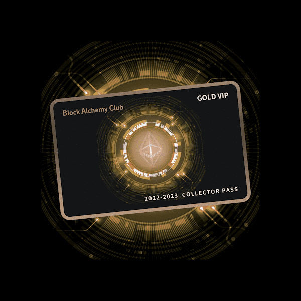

# BlockAlchemyClub

##### ▶ 什么是 BlockAlchemyClub？

BlockAlchemyClub 是一个 NFT（Non-fungible token）集合。存储在区块链上的数字艺术品集合。

##### ▶ 有多少 BlockAlchemyClub 代币？

总共有 395 个 BlockAlchemyClub NFT。目前，339 位所有者的钱包中至少有一个 BlockAlchemyClub NTF。

##### ▶ 最昂贵的 BlockAlchemyClub 销售是什么？

售出的最昂贵的 BlockAlchemyClub NFT 是 。它于 2022 年 6 月 9 日（3 个月前）以 280 美元的价格售出。

##### ▶ 最近卖出了多少 BlockAlchemyClub？

过去 30 天内售出了 133 个 BlockAlchemyClub NFT。

##### ▶ BlockAlchemyClub 的费用是多少？

过去 30 天，BlockAlchemyClub NFT 最便宜的销售额低于 159 美元，最高销售额超过 1620 美元。BlockAlchemyClub NFT 的中位价格在过去 30 天内为 333 美元。

##### ▶ 什么是流行的 BlockAlchemyClub 替代品？

许多拥有 BlockAlchemyClub NFT 的用户还拥有 

