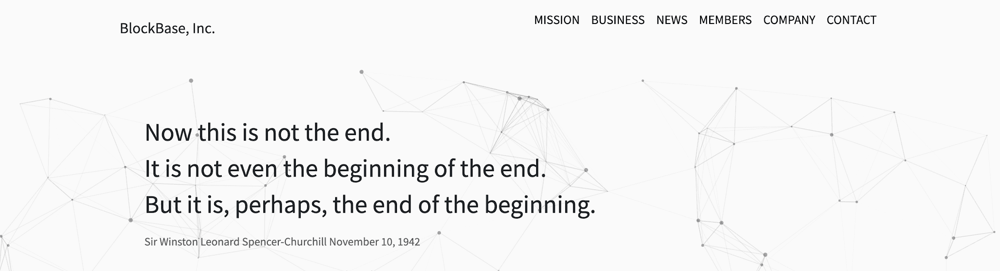

# BlockBase Sandbox

区块链相关技术咨询服务，使用区块链相关技术的产品规划和开发。BlockBase Co., Ltd.（总部：东京都新宿区/代表董事：Daiki Maki/以下简称 BlockBase）是 Dwango Co., Ltd.（总部：东京都中央区/总裁：Tsuyoshi Natsuno/以下简称 Dwango） ..，并于 2022 年 2 月发行，“Nico Nico NFT 合集”的第一期，“世界上唯一的左上角”NFT。我做到了。一般来说，NFT 发行大致分为通过市场发行和通过唯一合约发行。以市场依赖的方式发行 NFT 据说是在发行者对 NFT 没有完全主权的状态下，因为数据是在市场下管理的。在许多情况下，开发合同并发行和出售 NFT .

