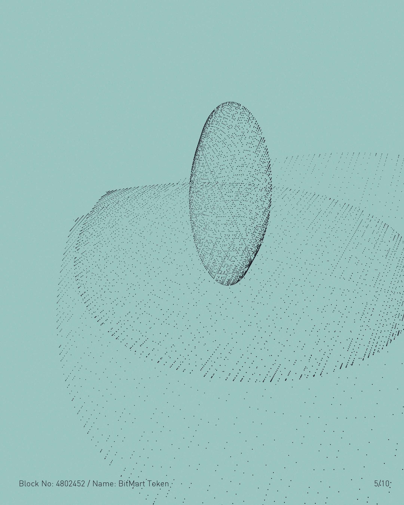

# Blockchain Art Institute

Original Block Collection是一组独特的视觉体验，由艺术家和 AI 共同创造，每一个都代表以太坊区块链上的特定区块编号。

我们非常自豪地说，研究所庆祝街区的使命已经在全球创意社区找到了许多支持者。因此，我们正在与来自不同背景的许多艺术家合作。画家、雕塑家、数字天才、音乐家和各种人才齐聚一堂，共同创作艺术作品，每件作品的灵感都来自以太坊区块链上的一个特殊区块。 

区块链艺术学院是一所诞生于物理与数字、新旧交汇的机构，其目标是一次一个区块地使我们共同的区块链历史永垂不朽。

