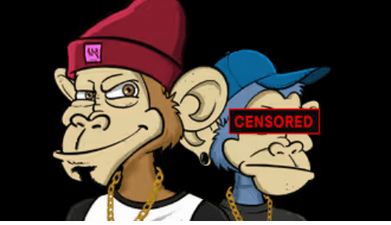

# Blockchain Frenz

Blockchain Frenz 是一个 NFT 集合，由 5,555 件和超过 99 个特征组成，旨在将街头文化和语言带入 Web3 世界。总计 5,555 件 / 2,000 件免费。铸造将于 7 月 17 日星期日晚上 9 点 UTC 开始。
如果您想充分利用免费铸造机会，请不要忘记关注我们的不和谐频道和我们的 Twitter 页面。欲了解更多信息，请在社交媒体平台上关注我们。NFT（Non-Fungible Tokens）是可以证明的数字资产唯一性，其所有者可以通过区块链证明其所有权。

