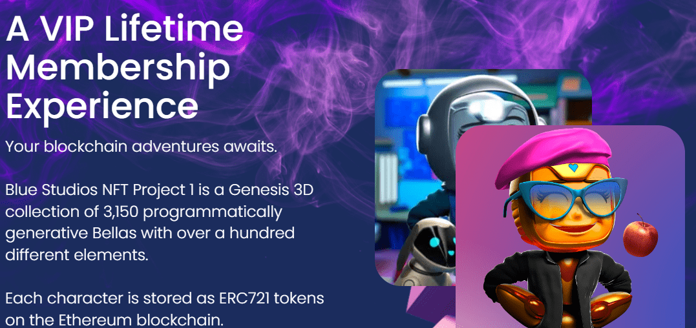

# Blockchain Adventures Of Bella The Blue Bot

Bella the Blue Bot 的区块链历险记是 NFT 的 3D 数字集合，作为 ERC-721 代币存储在以太坊区块链上。我们的 Genesis 系列由 3,150 个程序生成的 Bellas 组成，其中包含一百多种不同的元素。我们的 8,850 个独特代币的第二阶段即将推出。我们邀请您加入我们的社区，参与其中，看看我们如何共同建设。

我们是 Trekkies 和 Marvel 的狂热爱好者，我们想永远向孩子们展示科幻小说，尤其是太空旅行。

所以我们开发*了蓝色机器人贝拉历险记*。
‍ 我们
想向孩子们展示我们之间的共同点多于没有的共同点，以及我们今天所学的基础知识对于塑造明天的世界将变得如此重要。请继续关注贝拉、梅洛和罗斯穿越太空探索人类。

