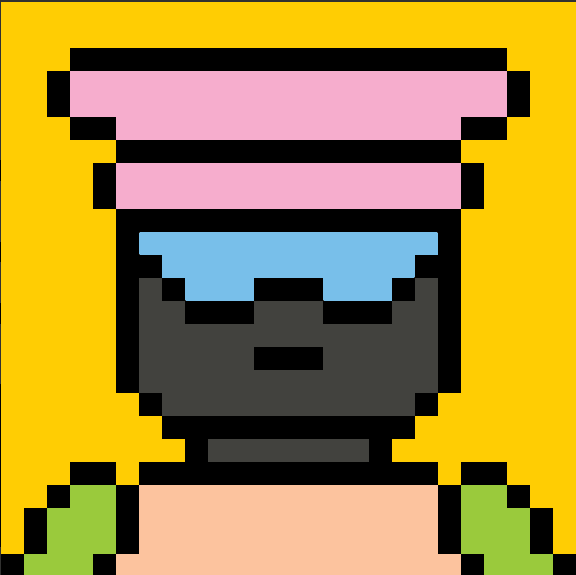

# Blockheads Family

4,000 个独特生成和可定制的字符完全存储在链上。没有 png，没有 jpeg，没有 IPFS。属性可以在同一个钱包中的不同 Blockhead 之间交换
Blockheads 家族系统
定义模块化系统、属性、智能合约、数据库和艺术品，着眼于乐趣、参与和未来添加到 Blockheads Family 体验。
4000 Blockheads
Block Builder 开始生成具有各种稀有度的 Blockhead。初始铸币厂价格为每个 Blockhead 0.05 ETH。
重配置器和收集工具
分解 Blockheads 并从他们的部分构建新的。找到完美的作品，与朋友交易，收集并定制您自己的作品。我们正在构建工具以帮助更好地管理您的收藏
零件、宠物和世界建筑
我们通过空投特殊物品开始世界建设。某些物品的稀有度取决于抽奖的运气，而其他物品的稀有度取决于您拥有的独特 Blockheads。
迁移到 L2
随着项目的发展，我们需要使用一个新的链来支持更快的交换、更低的 gas 费用和整个项目的更多多样性。您的 v1 Blockhead 是您进入 v2 的门票。

