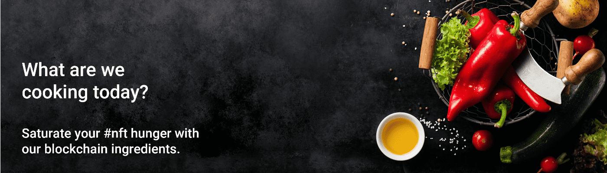

# blockrecipes.com

您并非每天都能看到带有美味转折的随机纯文本 NFT。加入我们，让美味的纯文本 NFT 成为新的狂欢。随机配方成分为#nft。故意省略了烹饪说明、重量和数量。灵感来自
@lootproject在 1-10 的范围内，您如何评价您的烹饪技巧？如果你有一个随机的成分清单来制作一些东西，你会成功吗？
为什么不试试我们的随机成分 NFT 并成为今天的区块链厨师？

立即成为区块链厨师！ 👨‍🍳

如何铸造你的配料表。
✅2.点击“写合同”
✅3。连接您的 Metamask 钱包
✅4.投入 0.01 ETH
✅ 5. 收到你的第一个食谱！在您的#Opensea acc 中找到它！

