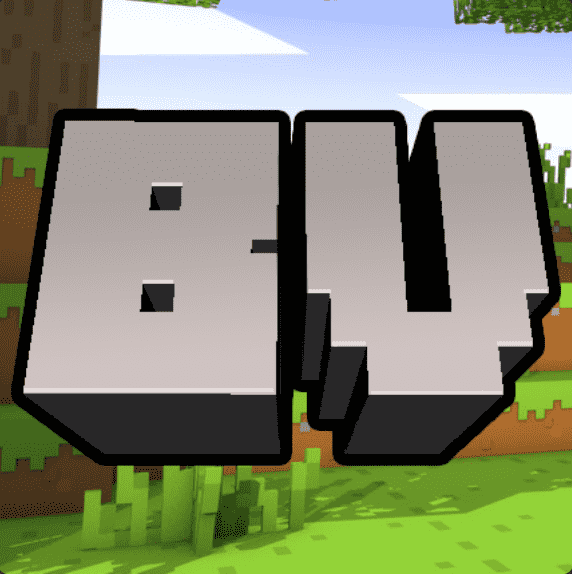

# Blockverse MC

以太坊区块链上的链上 NFT 以在 Minecraft 上启用 P2E。获胜的球员/球队根据他们的技能/上场时间获得奖励。体验与众不同的派系的快感。

Blockverse MC NFT - 常见问题（FAQ）
▶ 什么是 Blockverse MC？
Blockverse MC 是一个 NFT（非同质代币）集合。存储在区块链上的数字艺术品集合。
▶ 存在多少 Blockverse MC 代币？
总共有 9,999 个 Blockverse MC NFT。目前，4,580 名所有者的钱包中至少有一个 Blockverse MC NTF。
▶ 最昂贵的 Blockverse MC 销售是什么？
最昂贵的 Blockverse MC NFT 是 Blockverse #??? . 它于 2022 年 6 月 12 日（3 个月前）以 0 美元的价格出售。
▶ 最近卖出了多少 Blockverse MC？
过去 30 天内售出了 6 个 Blockverse MC NFT。
▶ 什么是流行的 Blockverse MC 替代品？
许多拥有 Blockverse MC NFT 的用户还拥有 Jungle Tycoon Cub、 KEVolution、 Lofi Kitties和 Funky Salamanders。

