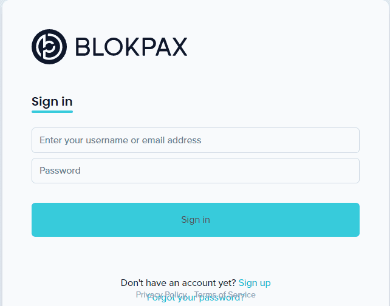

# Blokpax Fraxionals

Blokpax Fraxionals代表了对现有的一些最重要的现实世界（物理）交易卡收藏品的共同所有权利益。这些底层的实体卡是第一个在以太坊上将其所有权标记为Blokpax Vault Tokens的实体卡，这使得它们成为区块链验证实体收藏品所有权和出处的第一个例子。第一个编号为 0-99 的 Blokpax Vault 代币将作为 Fraxionals 分发给 Blokpax 社区。所有底层的实体卡都在 Blokpax 保险库的保税监管之下。任何特定基础卡的部分所有权权益基于以下等级：钻石： 2.028%红宝石： 1%黄金： 0.1%银： 0.03%青铜： 0.01%

