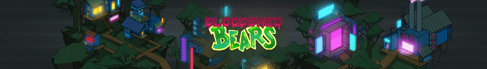

# BloodShed Bears Gen1

Gen 1 Bloodshed Bears 是 Bloodshed Bears 的第二个系列。欢迎来到部署在以太坊区块链上的 Bloodshed Bears NFT 游戏。BloodShed Bears 游戏将 P2E、风险、可升级的元数据和常规派系战争结合成独特的游戏体验。铸币时，每只流血熊都被随机分配到两个派系中的一个。产生 $BLD 和 Bloodshards 的多集合 NFT 质押游戏。我真的无法用言语来表达我对成为其中一员的感觉有多幸运@bloodshedbears 项目！！他们向社区提供服务的方式令人惊叹，他们总能找到一种方法来带来比前一天更好的新东西.

