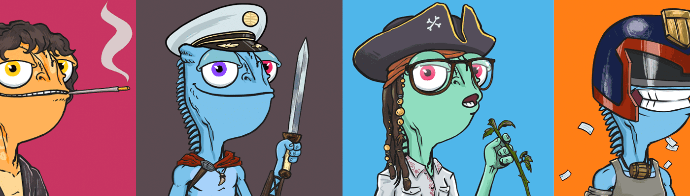

# Bloopers by METACITZN

Bloopers 允许您加入 METACITZN 创作者社区，包括访问在线和 IRL 放映、共享作品所有权、首映收藏允许列表等等！

METACITZN 是第一个去中心化的媒体制作集体。我们来这里是为了讲述 Metaverse 的故事，而 Blooper 是我们社区和作品的指南。

我们的电影和体验包括来自 Cool Cats、Pixel Vault、Gutter Cat Gang、Ghxsts、World of Women、Vinnie Hager、Joel Madden、M.Shadows、Misan Harriman、Flula Borg 等 NFT 艺术家、收藏品、名人和影响者其他。METACITZN 的 Bloopers 是一个 NFT（不可替代令牌）集合。存储在区块链上的数字艺术品集合。METACITZN NFT 总共有 848 个 Blooper。目前，387 位所有者的钱包中至少有一个 METACITZN NTF 的 Bloopers。

