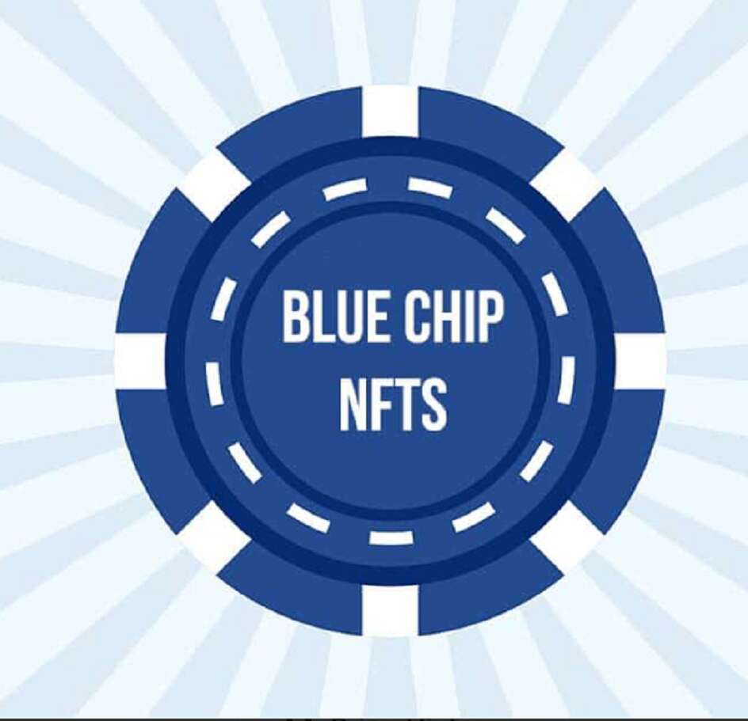

# BlueChipNFTz

什么是 NFT？ 不可替代代币 (NFT) 是下一代虚拟资产，不需要像比特币和以太坊那样首先获得货币价值。 它们可以代表汽车、房地产和黄金等实物资产的所有权，也可以代表电子游戏或稀有照片等数字物品的所有权。最近有很多人在寻找寻找和购买 NFT 的最佳地点，所以 我们将解释它是什么以及如何找到蓝筹股。什么是不可替代令牌 (NFT)？NFT（不可替代令牌）是可以交易但与可替代令牌具有不同价值的资产。 在这篇文章中，我们将讨论它们是什么，在哪里可以找到一些很好的例子，以及如果你对投资感兴趣，如何开始使用它们。

