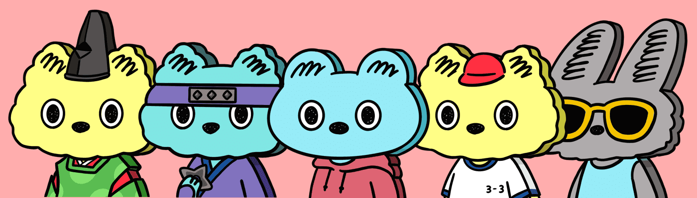

# Board Animal 2nd

BA miniBA的故事BA-浮世绘板动物是一种板形的神秘动物。它们的生态尚未被揭示。 ＝＝＝＝＝第一季：“Board Animal”（#001-#050）第二季：“kuweapon”（#01-#015）第三季：即将推出...Board Animal NFT - 常见问题（FAQ）
▶ 什么是板动物？
Board Animal 是 NFT（NFT 代替代币）收藏在区块链上的一个收藏品。不可收藏。
▶ 有多少 Board Animal 代币？
板有N个动物F。目前，64位的一个中至少有一个板动物F。
▶ 最贵的 Board Animal 销售是什么？
出卖最贵的 Board Animal NFT 是 Kweapon #06。它于 2022-06-25（2 个月前）以 109.8 美元的价格售出。
▶最近的动物呢？
过去 30 款售卖 NFT 3 个 Board Animal。
▶ 什么是流行的 Board Animal 替代品？
拥有 Board Animal NFT 的用户还拥有 PyonBoo、ChibabiesNFT、Pixel Heroines X 和 Kawaii_Meta_Fox。

