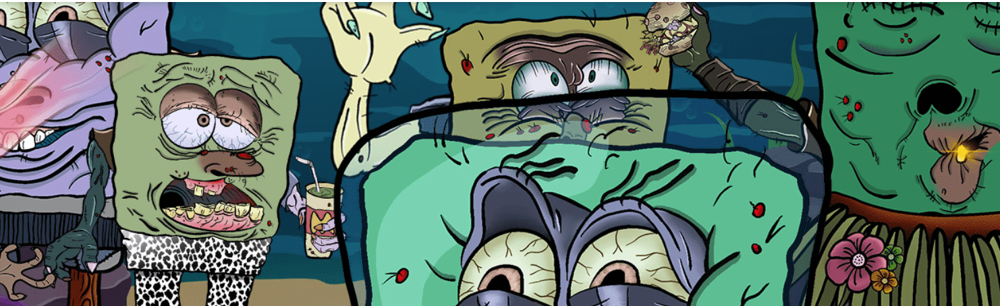

# boblintownwtf

售罄 - 免费薄荷 - 没有路线图 - 只是艺术 - Boblin 穿越大海boblintownwtf NFT - 问题常见（FAQ）
▶ 什么是 boblintownwtf？
boblintownwtf 是一个 NFT（非同质代币）集合。存储在区块链上的数字收藏品集合。
▶ 有多少 boblintownwtf 代币？
有一个新台币，94个boblintown wtf NFT。现在927个blintown中至少有一个fwt。
▶ 最贵的 boblintownwtf 销售是什么？
卖的最贵的 boblintownwtf NFT 是 boblintown #2893。它于 2022-06-09（3 个月前）以 270.8 美元售出。
▶最近最重要的是什么？
过去 30 条 N 款售出 boblintownwt 396 条。
▶ boblintownwtf 什么？
在过去的位置 00 1 6 美元，最便宜的 3 美元。
▶ 什么是流行的 boblintownwtf 替代品？
拥有 boblintownwtf NFT 的用户也拥有 Shell poop NFT、WolVerse、Schrootants 和 Proof Access Pass。

 
