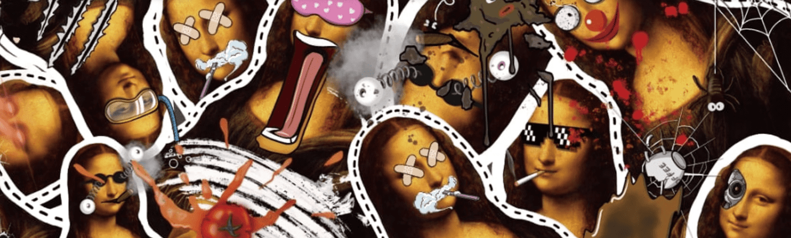

# Bonalisa

Bonalisa 意味着更好的蒙娜丽莎。我们相信这一点，因为艺术是狗屎。Bonalisa NFT - 常见问题（FAQ）
▶ 什么是博纳丽莎？
Bonalisa 是 NFT（非同质代币）集合。存储在一条链上的数字收藏品集合。
▶ 有多少 Bonalisa 代币？
个有一个Bonalisa，500个Bonalisa NFT。目前422个主的钱包中至少有一个Bonalisa。
▶ Bonalisa 最昂贵的交易是什么？
出售的价格最贵的 Bonalisa NFT 是 Bonalisa #89。它于 2022-06-23（2 个月前）以 54.9 美元售出。
▶最近一次？Bonalisa
过去 30 条经典的售卖 85 条 NFT。
▶ Bonalisa 的价格是多少？
在过去的天里，Bonalisa NFT 最便宜的 13 美元的美国价格，最多用了 3 美元。Bonalisa NFT 在过去 3 美元 10 美元的中位为 3 美元。
▶ 什么是流行的 Bonalisa 替代品？
拥有 Bonalisa NFT 的用户也拥有 Degenerate Dinos， Dogg it up Death Row Mixtape Vol。2、BODA PASS 和 BURNBAYC V2。

