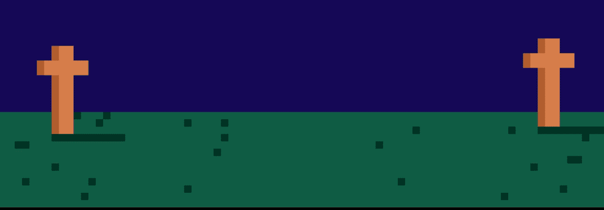

# BONE SOCIETY

快来加入 Secret Bone Society 多边形区块链上的 5000 个骨架 gif NFT 集合，BONE SOCIETY NFT - 问题常见（FAQ）
▶ 什么是社会？
BONE SOCIETY 是一个 NFT（不可替代代币）集合。存储在区块链上的数字收藏品集合。
▶ 有多少个 BONE SOCIETY 代币？
SOCF有5,00个SOCBONE IEFT。目前6个SOCIE一个N个的钱包中至少有一个BONE NT NT
▶ SOCIE 多少？ BONETY
在过去 30 个卖出 0 个 BONESOCIETY NFT。
▶ 什么是流行的 BONE SOCIETY 替代品？
拥有 BONE SOCIETY NFT 的用户还拥有 NFT Digital Art、Lord Panda、0xTastyBones_V2 和 Brilliant Incredible Muant Cats。

