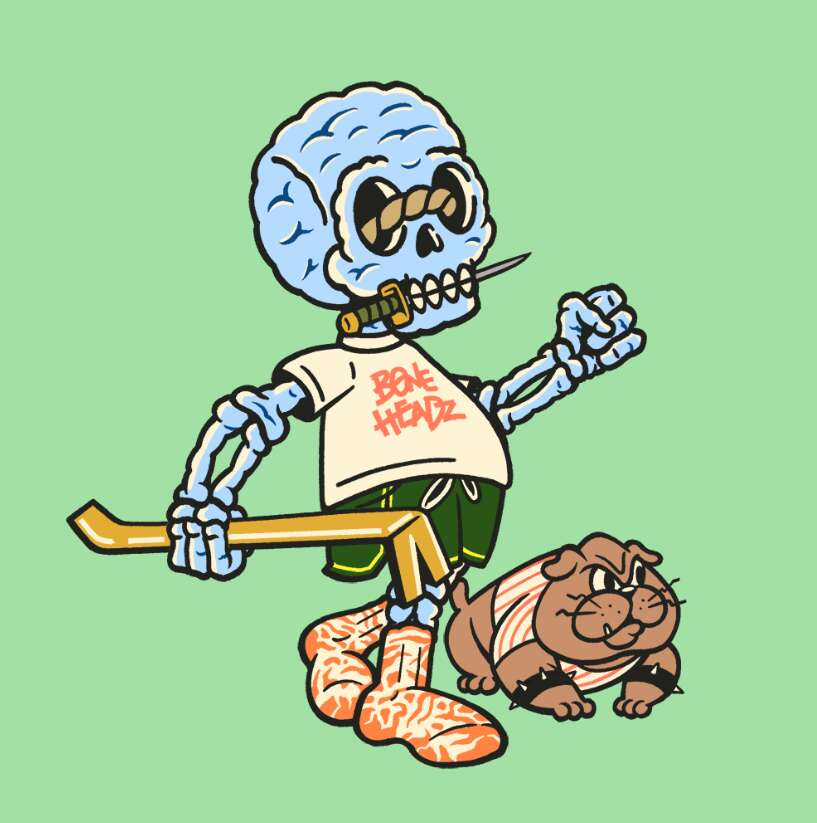

# BoneHeadz Official

BoneHeadz 是以太坊区块链上 5,000 个免费铸造和升级的 NFT 的集合。 每个 BoneHead 都是免费铸造的，并允许进入古墓袭击。 持有者支付少量费用来突袭坟墓，收集战利品并升级他们的 NFT，或者每个季节都在尝试死亡。 在赛季结束时拥有最多战利品的玩家将获得他们在 ETH 奖池中的份额。每个季节都会发现新的坟墓，但要谨慎行事 - 坟墓是危险的。每次突袭都会让你有机会带着战利品升级你的 NFT，或者在下个赛季被放逐到炼狱。在赛季结束时拥有最多战利品的人将赢得同等份额的奖池。袭击的人越多，奖金就越大。

