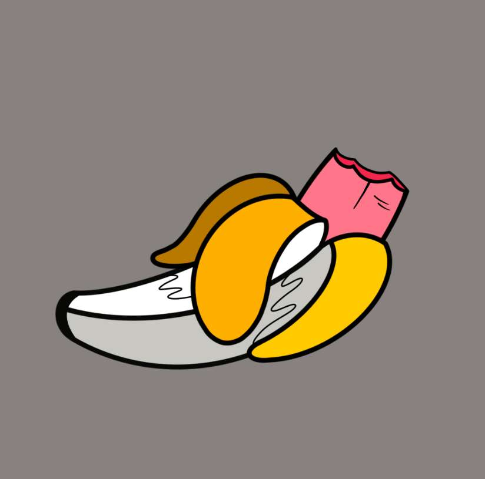

# Bones & Bananas

Bones & Bananas 是 10,000 个独特的、以编程方式生成的 Banana NFT 的集合，它们存在于以太坊区块链上！ 这是有史以来第一个非关联的、免费的、努力的、以社区为中心的、多价的、没有任何粘合曲线的收藏品项目！我们建立这个项目是为了完美地补充 BAYC 项目。 我们的目标是通过使用第一年所有销售收入的 20% 来支持 BAYC 和 BAKC 的底价，用于以底价购买猿和狗！ 香蕉持有者会自动进入未来的图纸，以免费或以极低的价格分发获得的猿和狗——我们的目标是通过这种方式让 BAYC nfts 更容易被社区访问。 骨头和香蕉上的艺术品同样赞美 BAYC！

