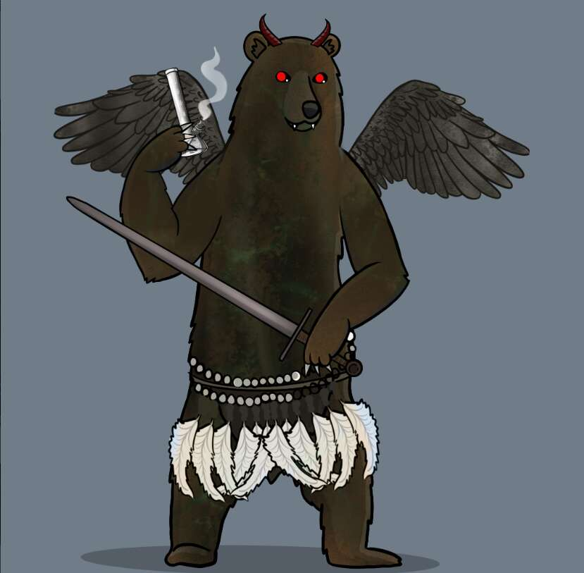

# The Boo Bears

这个万圣节有 271 个怪异的贝拉来找你

Boo Bears NFT - 常见问题（FAQ）
▶ 什么是 The Boo Bears？
Boo Bears 是一个 NFT（不可替代代币）系列。 存储在区块链上的数字艺术品集合。
▶ 有多少 The Boo Bears 代币？
总共有 268 个 The Boo Bears NFT。 目前，145 位车主的钱包中至少有一个 The Boo Bears NTF。
▶ The Boo Bears 最贵的拍卖会是什么？
最昂贵的 The Boo Bears NFT 是 Boo Bears #112。 它于 2022 年 8 月 25 日（8 天前）以 1.13 万美元的价格售出。
▶ 最近卖出了多少只 The Boo Bears？
过去 30 天内售出了 20 个 The Boo Bears NFT。
▶ The Boo Bears 的价格是多少？
在过去 30 天里，The Boo Bears NFT 最便宜的销售额低于 3806 美元，最高销售额超过 970 美元。 过去 30 天内，The Boo Bears NFT 的中位价格为 5.4 万美元。

